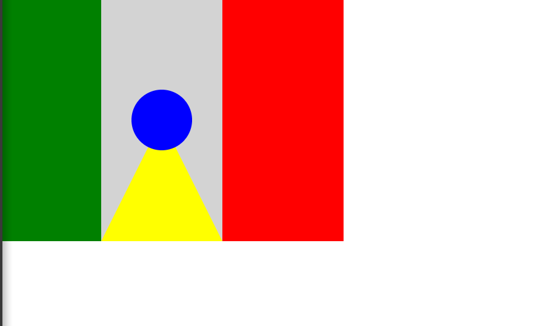

	Tem espaço para círculo
	exercício da semana 2 do alura
	Conteúdo: Lógica de programaçãoII: pratique com desenhos, animações e um jogo
	conteúdo ensinado durante as aulas:

	Nossa primeiroa obra de arte. Será?
	A vida não é deita de retângulos!
	Tem espaço para círculo também?

	 

	A cara do creeper
	exercício da semana 2 do alura
	Conteúdo: Lógica de programaçãoII: pratique com desenhos, animações e um jogo
	Aula: 01.Desenhando gráfico com Canvas

	Instrução:
	O Johann é um menino de 11 anos e adora jogar Minecraft. Minecraft é aquele jogo onde você constrói um mundo com blocos, como se fosse um Lego virtual. Ele gosta tanto que pediu um pôster de uma das personagens principais do jogo: o Creeper.

	

