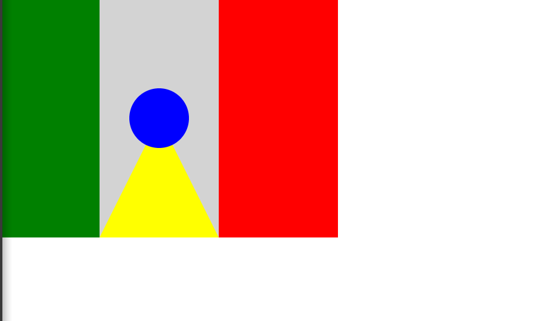
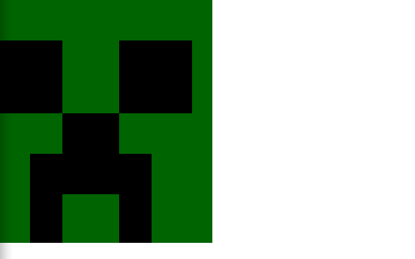
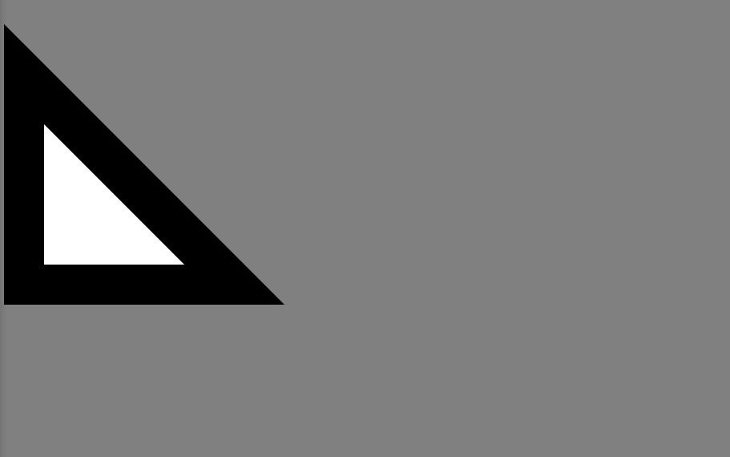
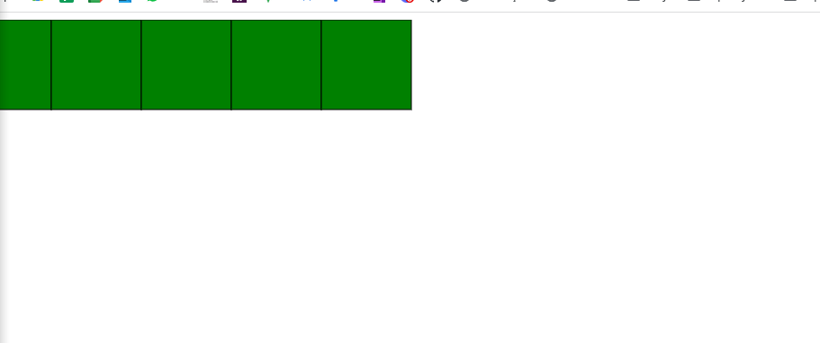
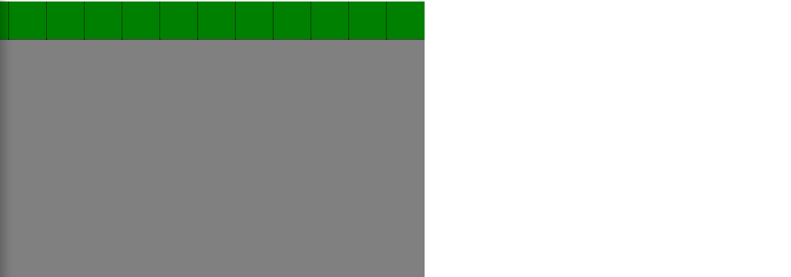
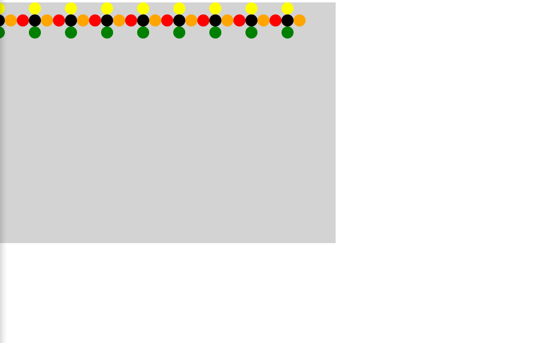
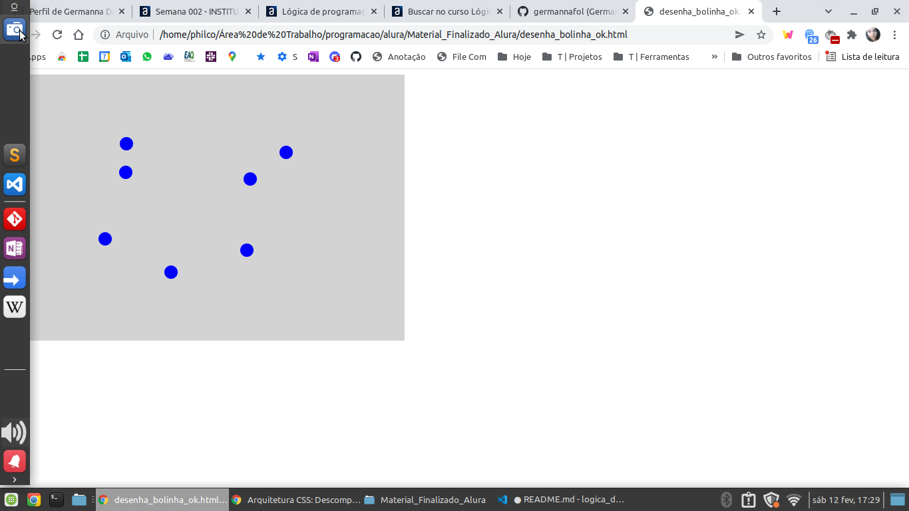
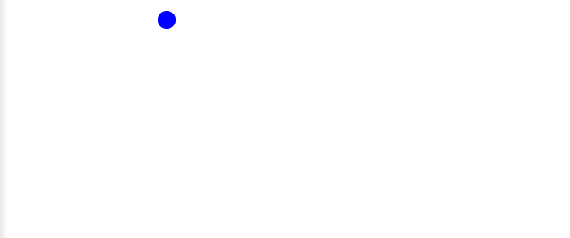
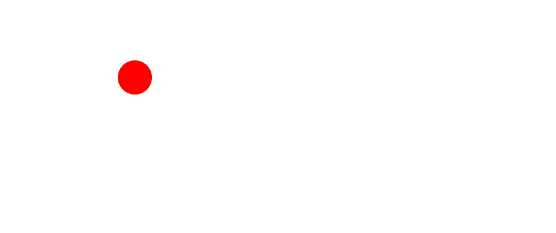

# Práticas semana 2 - Lógica de programação II: pratique com desenhos, animações e um jogo

## Aula 1 - Desehando Gráficos Com Canvas

1. Tem espaço para círculo

- Conteúdo ensinado durante as seguintes conteúdos
	- 06- Nossa primeiroa obra de arte. Será?
	- 07- A vida não é deita de retângulos!
	- 08- Tem espaço para círculo também?

2. A cara do creeper

- Conteúdo ensinado durante os seguintes conteúdos
	- 10 - A cara do creeper
Instrução: O Johann é um menino de 11 anos e adora jogar Minecraft. Minecraft é aquele jogo onde você constrói um mundo com blocos, como se fosse um Lego virtual. Ele gosta tanto que pediu um pôster de uma das personagens principais do jogo: o Creeper.

3. Esquadro

- Conteúdo ensinado durante os seguintes conteúdos
	- 11 - Esquadro

## Aula 2 - Extraíndo Funções

1. Uma inofesiva Flor

- Conteúdo ensinado durante os seguintes conteúdos
	- 9 - Frações

ATENÇÃO: É feito a pergunta de numerador e denominador

2. Deseha quadrados com bordas

- Conteúdo ensinado durante os seguintes conteúdos
	- 1 - Repetir Código Não Rola
	- 3 - Uma Função Mais Generica

3. Frações

- Conteúdo ensinado durante os seguintes conteúdos
	- 8 - Uma inofesiva Flor

## Aula 3 - Interagindo Com O Usuário 

1. Desenhando com o Mouse

- Conteúdo ensinado durante os seguintes conteúdos
	- 8 - Desenhando com o Mouse

## Aula 4 - Movendo Elementos Uma Animação Simples

1. Tudo Que Vai Volta

- Conteúdo ensinado durante os seguintes conteúdos
	- 1 - Desehando um círculo e daí?
	- 2 - Desenhando
	- 3 - Uma Animação Simples
	- 6 - Tudo que vai volta

2. O Pulso Ainda Pulsa

- Conteúdo ensinado durante os seguintes conteúdos
	- 7 - O Pulso Ainda Pulsa

